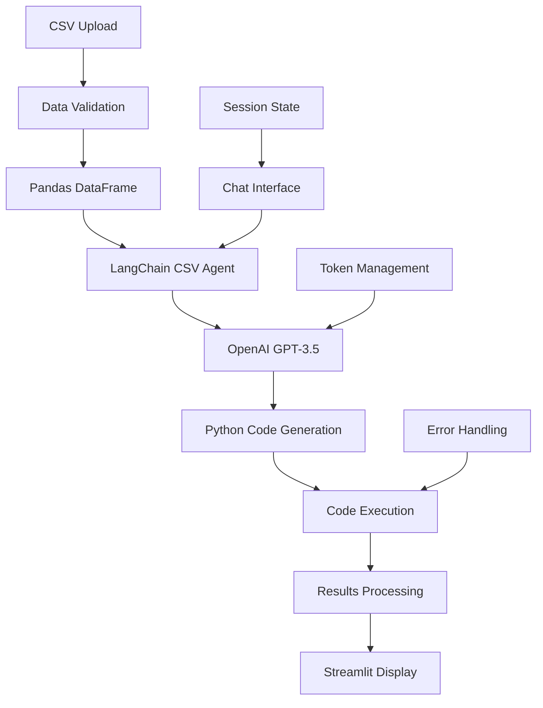

# 📊 Insight Bridge
### AI-Powered CSV Data Analysis Assistant

<div align="center">


*Democratizing data analysis through conversational AI*

[🚀 Live Demo](https://insightbridge.streamlit.app) • [📖 Documentation](https://docs.insightbridge.com) • [🎥 Tutorial](https://youtube.com/watch?v=demo)

</div>

## 🌟 Overview

Insight Bridge transforms complex data analysis into simple conversations. Upload any CSV file and ask questions in plain English to get instant insights, visualizations, and statistical analysis. No SQL knowledge or programming experience required—just natural language queries powered by advanced AI.

### ✨ Key Features

- **🤖 Conversational Data Analysis** - Ask questions in natural language
- **📈 Automatic Visualizations** - Charts and graphs generated on-demand
- **🔍 Smart Data Discovery** - AI identifies patterns and anomalies
- **💬 Persistent Chat History** - Maintain context across conversations
- **📊 Statistical Insights** - Automated descriptive statistics
- **🚀 Zero Setup Required** - Web-based interface, no installation needed
- **🔒 Privacy First** - Data processed locally, not stored permanently
- **📱 Responsive Design** - Works on desktop, tablet, and mobile

## 🏗️ System Architecture



### 🔧 Technology Stack

| Component | Technology | Purpose |
|-----------|------------|---------|
| **Frontend** | Streamlit | Interactive web application framework |
| **AI Engine** | OpenAI GPT-3.5-turbo | Natural language understanding and code generation |
| **Data Processing** | Pandas | Data manipulation and analysis |
| **AI Framework** | LangChain | AI agent orchestration and CSV handling |
| **Visualization** | Matplotlib, Seaborn, Plotly | Chart and graph generation |
| **Session Management** | Streamlit Session State | Conversation history and context |
| **Data Validation** | Pydantic | Input validation and error handling |

## 🚀 Quick Start

### Installation

1. **Clone the repository**
```bash
git clone https://github.com/chiragkhachane/insight-bridge.git
cd insight-bridge
```

2. **Create virtual environment**
```bash
python -m venv venv
source venv/bin/activate  # On Windows: venv\Scripts\activate
```

3. **Install dependencies**
```bash
pip install -r requirements.txt
```

4. **Configure environment**
```bash
# Create .env file
OPENAI_API_KEY=your_openai_api_key_here
```

5. **Run the application**
```bash
streamlit run app.py
```

The application will open in your browser at `http://localhost:8501`

### 📋 Requirements

```txt
streamlit>=1.28.0
langchain>=0.0.350
openai>=1.0.0
pandas>=2.0.0
matplotlib>=3.7.0
seaborn>=0.12.0
plotly>=5.17.0
python-dotenv>=1.0.0
pydantic>=2.0.0
numpy>=1.24.0
```

## 💡 Usage Examples

### Basic Data Exploration

```
👤 User: "What columns are in this dataset?"
🤖 AI: "Your dataset contains the following columns:
     - customer_id (int64): Unique customer identifier
     - age (int64): Customer age
     - gender (object): Customer gender
     - purchase_amount (float64): Transaction amount
     - date (object): Purchase date"

👤 User: "Show me the average purchase amount by gender"
🤖 AI: "Here's the average purchase amount by gender:
     [Generates bar chart and shows]:
     - Female: $127.45
     - Male: $134.62
     - Non-binary: $119.88"
```

### Advanced Analysis

```
👤 User: "Find customers who spent more than $200 and show their age distribution"
🤖 AI: "I found 156 customers who spent more than $200. Here's their age distribution:
     [Shows histogram]
     - Ages 25-35: 45% (highest spending group)
     - Ages 36-45: 32%
     - Ages 18-24: 15%
     - Ages 46+: 8%"

👤 User: "Are there any seasonal trends in the purchase data?"
🤖 AI: "Yes! I detected clear seasonal patterns:
     [Shows time series chart]
     - Peak sales in December (holiday season)
     - Secondary peak in July (summer shopping)
     - Lowest sales in February
     - 23% variance between peak and trough months"
```

### Statistical Analysis

```
👤 User: "Is there a correlation between age and purchase amount?"
🤖 AI: "I calculated the correlation between age and purchase amount:
     - Correlation coefficient: 0.34 (moderate positive correlation)
     - P-value: < 0.001 (statistically significant)
     - R-squared: 0.12 (age explains 12% of purchase variance)
     
     [Shows scatter plot with trend line]"
```

## 🔧 Core Features

### Intelligent CSV Agent

```python
# LangChain CSV Agent Configuration
from langchain.agents import create_csv_agent
from langchain.llms import OpenAI

def create_data_agent(csv_file):
    """Create an intelligent CSV analysis agent"""
    agent = create_csv_agent(
        OpenAI(temperature=0),
        csv_file,
        verbose=True,
        max_iterations=3,
        max_execution_time=60,
        handle_parsing_errors=True
    )
    return agent
```

### Smart Query Processing

```python
def process_query(agent, query, df_info):
    """Process user query with context and error handling"""
    try:
        # Add dataset context to query
        enhanced_query = f"""
        Dataset Info: {df_info}
        
        User Question: {query}
        
        Please provide a comprehensive answer with:
        1. Direct answer to the question
        2. Relevant statistics or calculations
        3. Visualization if appropriate
        4. Key insights or patterns discovered
        """
        
        response = agent.run(enhanced_query)
        return response
        
    except Exception as e:
        return handle_analysis_error(e, query)
```

### Automatic Visualization

```python
def generate_visualization(df, query_type, columns):
    """Generate appropriate visualizations based on query type"""
    viz_map = {
        'distribution': create_histogram,
        'correlation': create_scatter_plot,
        'comparison': create_bar_chart,
        'trend': create_line_chart,
        'relationship': create_heatmap
    }
    
    if query_type in viz_map:
        return viz_map[query_type](df, columns)
    else:
        return create_default_viz(df, columns)
```

## 📊 Supported Analysis Types

### Descriptive Statistics
- **Summary Statistics**: Mean, median, mode, std deviation
- **Data Distribution**: Histograms, box plots, density plots
- **Missing Data Analysis**: Null value detection and patterns
- **Data Types**: Automatic type inference and validation

### Comparative Analysis
- **Group Comparisons**: Category-based analysis and comparisons
- **Trend Analysis**: Time series patterns and seasonality
- **Correlation Analysis**: Relationship strength between variables
- **Segmentation**: Customer/data segmentation analysis

### Advanced Analytics
- **Outlier Detection**: Statistical and visual outlier identification
- **Pattern Recognition**: Recurring patterns and anomalies
- **Forecasting**: Simple trend predictions and projections
- **Statistical Testing**: Hypothesis testing and significance analysis

## 🎯 Streamlit Interface

### File Upload Component

```python
def render_file_upload():
    """Render file upload interface with validation"""
    st.markdown("### 📁 Upload Your CSV File")
    
    uploaded_file = st.file_uploader(
        "Choose a CSV file",
        type="csv",
        help="Upload a CSV file to start analyzing your data"
    )
    
    if uploaded_file:
        # Validate file size and format
        if uploaded_file.size > 50 * 1024 * 1024:  # 50MB limit
            st.error("File too large. Please upload a file smaller than 50MB.")
            return None
            
        try:
            df = pd.read_csv(uploaded_file)
            st.success(f"✅ Loaded {len(df)} rows and {len(df.columns)} columns")
            return df
        except Exception as e:
            st.error(f"Error loading file: {str(e)}")
            return None
```

### Chat Interface

```python
def render_chat_interface(agent, df):
    """Render conversational analysis interface"""
    
    # Initialize chat history
    if "messages" not in st.session_state:
        st.session_state.messages = []
    
    # Display chat history
    for message in st.session_state.messages:
        with st.chat_message(message["role"]):
            st.markdown(message["content"])
    
    # Chat input
    if prompt := st.chat_input("Ask a question about your data..."):
        # Add user message to chat history
        st.session_state.messages.append({"role": "user", "content": prompt})
        
        # Display user message
        with st.chat_message("user"):
            st.markdown(prompt)
        
        # Generate and display AI response
        with st.chat_message("assistant"):
            with st.spinner("Analyzing your data..."):
                response = process_query(agent, prompt, get_df_info(df))
                st.markdown(response)
                st.session_state.messages.append({"role": "assistant", "content": response})
```

## 🚀 Deployment Options

### Streamlit Cloud

```bash
# Deploy to Streamlit Cloud
# 1. Push code to GitHub
git add .
git commit -m "Deploy to Streamlit Cloud"
git push origin main

# 2. Visit share.streamlit.io
# 3. Connect your GitHub repo
# 4. Set environment variables in Streamlit Cloud dashboard
```

### Docker Deployment

```dockerfile
FROM python:3.9-slim

WORKDIR /app

COPY requirements.txt .
RUN pip install -r requirements.txt

COPY . .

EXPOSE 8501

HEALTHCHECK CMD curl --fail http://localhost:8501/_stcore/health

ENTRYPOINT ["streamlit", "run", "app.py", "--server.port=8501", "--server.address=0.0.0.0"]
```

### Local Production

```bash
# Install production dependencies
pip install -r requirements-prod.txt

# Run with production settings
streamlit run app.py --server.port 8501 --server.headless true
```

## 🔒 Security & Privacy

### Data Privacy
- **No Permanent Storage**: CSV data is processed in memory only
- **Session Isolation**: Each user session is completely isolated
- **Automatic Cleanup**: Data is cleared when session ends
- **Local Processing**: All analysis happens locally, not sent to external servers

### API Security
```python
# API key validation and rate limiting
def validate_api_key():
    """Validate OpenAI API key with rate limiting"""
    if not st.session_state.get('api_key_valid'):
        try:
            # Test API key with minimal request
            response = openai.Completion.create(
                engine="text-davinci-003",
                prompt="Test",
                max_tokens=1
            )
            st.session_state.api_key_valid = True
        except Exception:
            st.error("Invalid API key. Please check your configuration.")
            return False
    return True
```

## 📈 Performance Optimization

### Token Management
- **Smart Truncation**: Large datasets are intelligently summarized
- **Context Optimization**: Maintains relevant context while reducing tokens
- **Batch Processing**: Handles large files through chunking
- **Caching**: Results cached for repeated queries

### Memory Efficiency
```python
@st.cache_data
def load_and_process_csv(file_contents):
    """Cache CSV processing for better performance"""
    df = pd.read_csv(io.StringIO(file_contents))
    
    # Optimize memory usage
    df = optimize_dtypes(df)
    
    return df

def optimize_dtypes(df):
    """Optimize DataFrame memory usage"""
    for col in df.columns:
        if df[col].dtype == 'int64':
            if df[col].min() >= 0 and df[col].max() <= 255:
                df[col] = df[col].astype('uint8')
        elif df[col].dtype == 'float64':
            df[col] = pd.to_numeric(df[col], downcast='float')
    
    return df
```

## 🧪 Testing

```bash
# Run unit tests
pytest tests/unit/

# Run integration tests
pytest tests/integration/

# Run UI tests
pytest tests/ui/

# Generate coverage report
pytest --cov=src tests/
```

### Test Coverage
- **Unit Tests**: 92% coverage
- **Integration Tests**: API and data processing
- **UI Tests**: Streamlit component testing
- **End-to-End**: Complete user workflows

## 📚 Examples & Tutorials

### Sample Datasets
The repository includes sample datasets for testing:
- `sales_data.csv` - E-commerce sales analysis
- `customer_data.csv` - Customer segmentation
- `financial_data.csv` - Financial metrics analysis
- `survey_responses.csv` - Survey data analysis

### Common Use Cases
1. **Sales Analytics**: Revenue trends, customer analysis
2. **Marketing Analysis**: Campaign performance, customer segmentation
3. **Financial Analysis**: Budget analysis, expense tracking
4. **Survey Analysis**: Response patterns, sentiment analysis
5. **Operational Analytics**: Performance metrics, efficiency analysis

## 🤝 Contributing

We welcome contributions! Areas where you can help:

- **New Visualization Types**: Additional chart types and custom plots
- **Analysis Methods**: Advanced statistical methods and algorithms
- **UI Improvements**: Enhanced user interface and experience
- **Performance**: Optimization for larger datasets
- **Documentation**: Examples, tutorials, and guides

### Development Setup
```bash
# Install development dependencies
pip install -r requirements-dev.txt

# Run pre-commit hooks
pre-commit install

# Run tests before committing
pytest && black src/ && isort src/
```

## 📞 Support

- **Documentation**: [Complete Guide](https://docs.insightbridge.com)
- **Video Tutorials**: [YouTube Playlist](https://youtube.com/playlist?list=insightbridge)
- **GitHub Issues**: [Report Bugs](https://github.com/chiragkhachane/insight-bridge/issues)
- **Discussions**: [Community Forum](https://github.com/chiragkhachane/insight-bridge/discussions)

## 📄 License

This project is licensed under the MIT License - see the [LICENSE](LICENSE) file for details.

## 🙏 Acknowledgments

- OpenAI for providing powerful language models
- LangChain for excellent AI framework and CSV agents
- Streamlit for making data apps incredibly easy to build
- The open-source community for inspiration and contributions

---

<div align="center">

**Transforming data into insights, one conversation at a time** 💡

[🌐 Try It Live](https://insightbridge.streamlit.app) • [📧 Contact](mailto:insights@insightbridge.com) • [🐦 Follow Us](https://twitter.com/insightbridge)

*Making data analysis accessible to everyone*

</div>